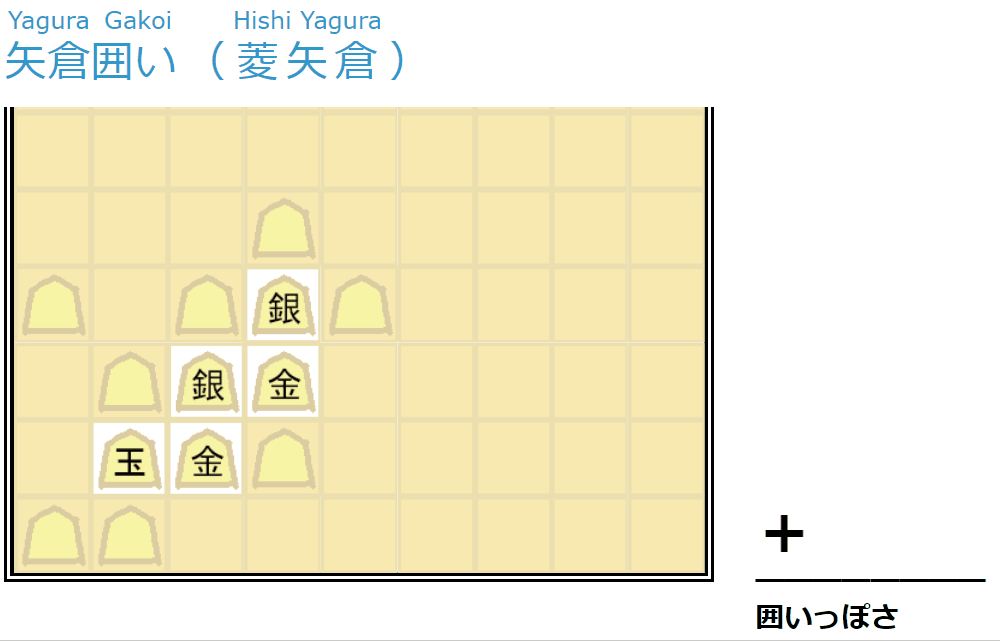
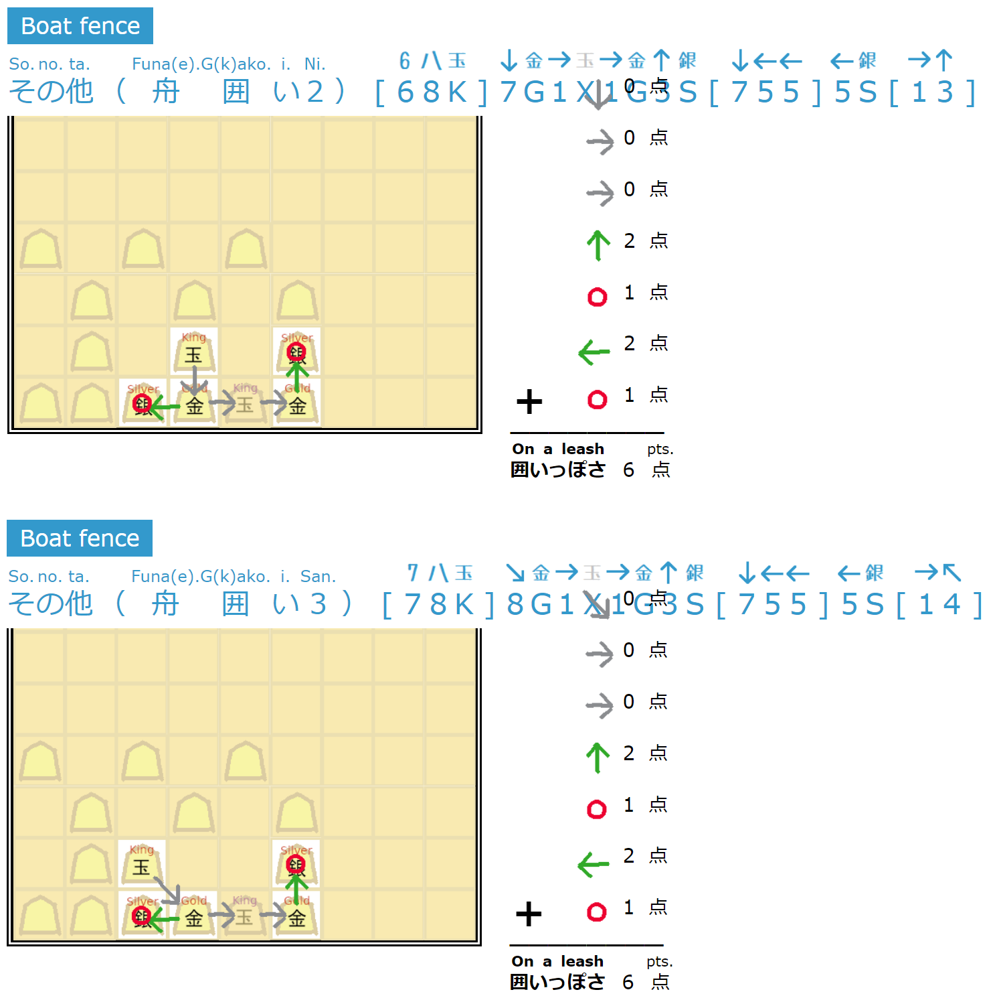

# enclosure-of-shogi

将棋の **囲いっぽさ** 半自動計算機。  

  
↑ 経路違いの同じ点数の場合、 （１）ID が短い方、 （２）ID を辞書順で比較して小さい方 の順で優先してください。  

  
↑ 玉が連続して動くときは、動き出す前の位置に ゴースト玉(X) を置いてください。  

## How to use

Please look the data directory.  

Copy it and Paste to `public/input.js`.

Click the `public/main.html`.

## Appendix

It will be faster:  

Click the `public/main.html?anime=off`.
